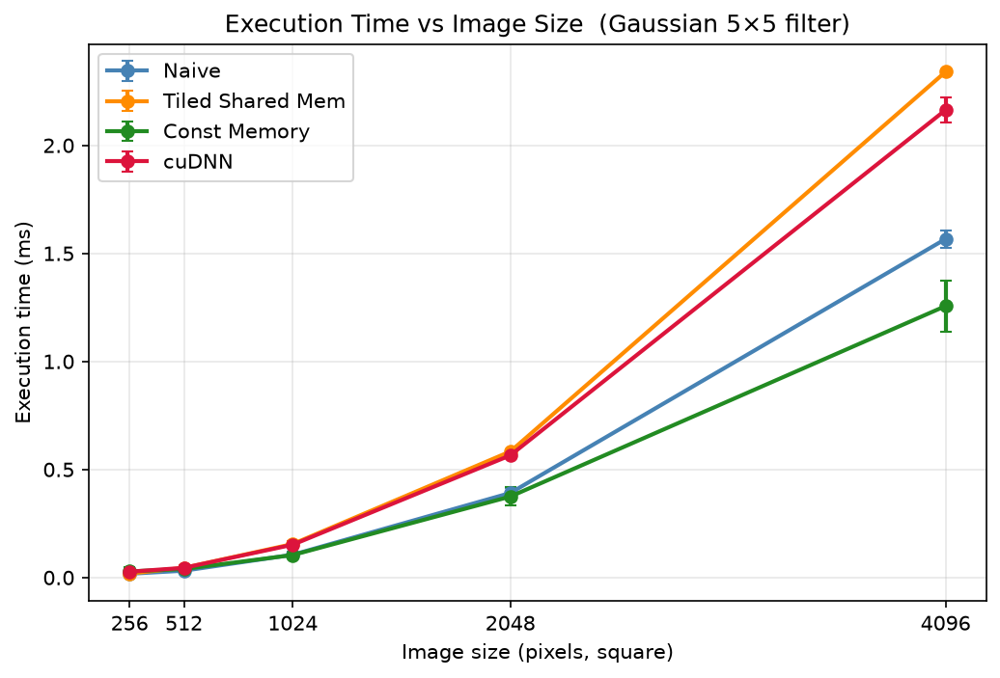
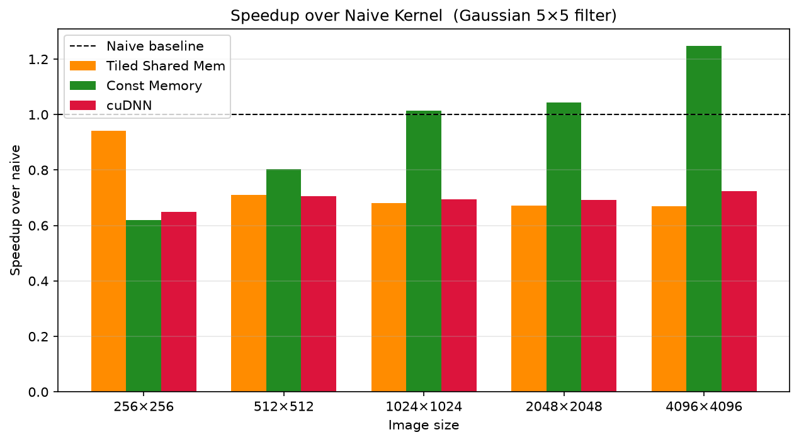
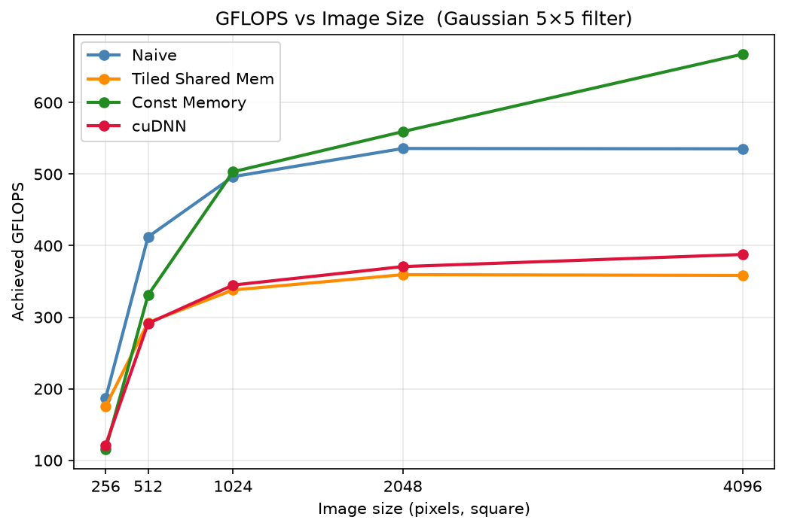
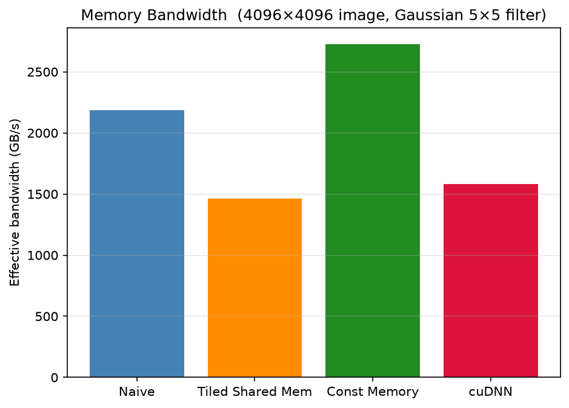
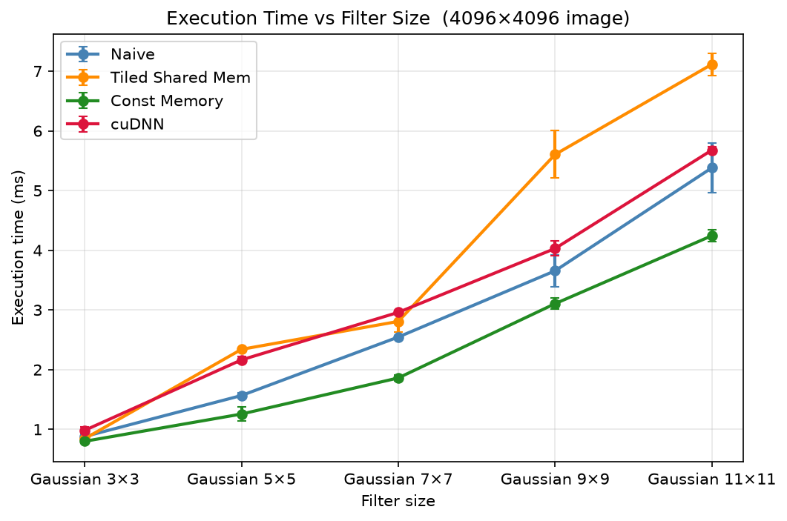

# CUDA 2D Convolution Benchmarks

Benchmarks four implementations of 2D image convolution on the GPU across image sizes (256²-4096²) and Gaussian filter sizes (3×3-11×11).

---

## Members: Group - A

- Abhishek Roy (Student ID: 2502895)
- Ha Do (Student ID: 2402703)

## Getting Started

### Requirements

- CUDA 12.x (`nvcc`)
- Python 3.11+
- GPU with compute capability ≥ 8.0

```bash
uv sync
```

### Build

```bash
make clean && make
```

Override the compute architecture if needed (default `sm_89` for RTX 40-series):

```bash
make clean && make CUDA_ARCH=sm_86
```

### Run

```bash
python3 main.py          # full benchmark sweep
python3 main.py --plot   # benchmark + generate plots
python3 main.py --plot-only  # re-generate plots from existing results
```

Results are written to `results/benchmark.log`. Plots and CSV are saved in `results/plots/`.

---

## Project Structure

```text
├── src/
│   ├── naive_conv.cu        # Naive global memory kernel
│   ├── tiled_conv.cu        # Tiled shared memory kernel
│   ├── const_mem_conv.cu    # Constant memory kernel
│   ├── cudnn_conv.cpp       # cuDNN wrapper
│   ├── cpu_reference.cpp    # CPU reference (correctness baseline)
│   ├── benchmark.cpp        # Timing harness for all kernels
│   ├── tests.cpp            # Correctness checks vs CPU reference
│   ├── gpu_buffers.cpp      # Device memory allocation helpers
│   └── main.cpp             # Entry point and CLI
├── include/
│   ├── conv.h               # Shared types and function declarations
│   ├── utils.h              # CudaTimer, CHECK_CUDA, file I/O, printing
│   ├── gpu_buffers.h
│   └── tests.h
├── scripts/
│   ├── generate_benchmark_data.py   # Generates PGM images and filter files
│   ├── plot_results.py              # Produces plots from benchmark.log
│   └── make_slides.py               # Generates PowerPoint presentation
├── data/
│   ├── images/              # Generated PGM test images
│   └── filters/             # Generated Gaussian filter files
├── results/                 # Created at runtime
│   ├── benchmark.log
│   ├── slides.pptx
│   └── plots/
├── main.py                  # Benchmark runner
└── Makefile
```

---

## 2D Convolution

For each output pixel, slide an F×F filter over the input image and compute a weighted sum of the local neighborhood:

```text
output[r, c] = Σ_{i,j}  input[r - R + i, c - R + j] · filter[i, j]
```

Since every output pixel is independent, the operation is naturally parallelizable. The main challenge, however, is memory. Adjacent output pixels need overlapping input regions, so naive per-thread reads cause enormous redundant memory traffic: both the filter and large portions of the input are re-read from scratch by every thread.

---

## Hardware

| Component | Detail |
| --- | --- |
| GPU | NVIDIA GeForce RTX 4060 Laptop GPU |
| VRAM | 8 GB GDDR6 |
| Compute capability | 8.9 (Ada Lovelace) |
| CUDA version | 12.9 |
| Driver | 591.86 |
| L2 cache | 24 MB |

---

## Implementations

All implementations use the following input and filter configuration.

**Input:** Single-channel grayscale PGM images, 256×256 up to 4096×4096 pixels.

**Filter:** Normalized Gaussian kernel, 3×3 up to 11×11, stored as a flat float array.

### 0. CPU Reference: Correctness Baseline

A straightforward sequential implementation on the CPU. Four nested loops: iterate over every output pixel, then over every filter position, accumulate the weighted sum:

```cpp
for (int out_row = 0; out_row < H; ++out_row)
    for (int out_col = 0; out_col < W; ++out_col) {
        float sum = 0.f;
        for (int fr = -R; fr <= R; ++fr)
            for (int fc = -R; fc <= R; ++fc)
                sum += input[(out_row+fr)*W+(out_col+fc)] * filter[(fr+R)*fw+(fc+R)];
        output[out_row * W + out_col] = sum;
    }
```

There is no parallelism here as every output pixel is computed one at a time, making it slow. It exists to verify the computational correctness of all four GPU kernels.

---

### 1. Naive GPU Approach

It is the simplest GPU port of the CPU reference. The kernel launches a grid of 16×16 thread blocks with each thread being responsible for one output pixel. Each thread independently reads everything it needs directly from global memory, including the full F×F filter, with no sharing between threads. For a 4096×4096 image with an 11×11 filter, that is 121 separate filter reads per thread and around 16 million threads. The GPU's L1/L2 caches absorb some of the repeated reads, but the re-read of the same filter hits memory heavily.

The naive kernel is the GPU performance baseline that tiled, constant memory, and cuDNN are compared against.

---

### 2. Tiled Shared Memory: Cooperative Input Loading

The problem with naive is that adjacent threads need overlapping input regions, but each fetches its own copy from global memory.

The fix is to have all threads in a block cooperate to load a shared patch of the input into a shared space accessible to all threads in a block. This is where shared memory comes into play.

Shared memory is a small, fast, on-chip memory region that all threads in a block can read and write. It sits physically on the SM chip itself, making it roughly 100x faster than global memory.

The block loads a *tile*: an output region of TILE_WIDTH×TILE_WIDTH pixels with a *halo* border of width R on every side. The halo is necessary because border output pixels need input data that falls outside the output tile.

---

### 3. Constant Memory: Filter Broadcast Cache

Even with shared memory for the input, the filter is still read from global memory by every thread on every iteration. For an 11×11 filter, that is 121 global memory reads per output pixel across each warp, even though every thread in the warp reads the same filter element at the same time.

This is exactly what `__constant__` memory is built for. When all 32 threads in a warp read the same address, the hardware *broadcasts* it in **one transaction** instead of 32.

The benefit grows with filter size. For an 11×11 filter, each warp replaces 121 × 32 = 3,872 potential global memory reads with 121 broadcasts.

---

### 4. cuDNN: Library Baseline

cuDNN is NVIDIA's production convolution library used in deep learning frameworks. It auto-selects the best algorithm (implicit GEMM, Winograd, FFT-based) for the given tensor shapes.

A context is created once and reused across all timed runs, so algorithm selection is not charged to the measurement.

---

## Benchmark Methodology

Each configuration is timed with CUDA events (measuring GPU execution time only). Three warmup runs are discarded before collecting 50 timed runs. Mean and standard deviation are reported.

```text
GFLOPS    = 2 × H × W × F² / (mean_s × 1e9)
BW (GB/s) = H × W × (2F² + 1) × 4 bytes / (mean_s × 1e9)
```

`mean_s` is the mean execution time in seconds (`mean_ms / 1000`).

| Dimension | Values |
| --- | --- |
| Image sizes | 256², 512², 1024², 2048², 4096² |
| Filter sizes | 3×3, 5×5, 7×7, 9×9, 11×11 (Gaussian) |
| Padding | Zero-padding |
| Timed runs | 50 |
| Warmup runs | 3 |

---

## Results

All tables and plots use the **5×5 Gaussian filter** (R=2) unless noted otherwise.

### Execution Time vs Image Size

| Image | naive (ms) | tiled (ms) | const_mem (ms) | cuDNN (ms) |
| --- | --- | --- | --- | --- |
| 256² | 0.018 | 0.019 | 0.028 | 0.027 |
| 512² | 0.032 | 0.045 | 0.040 | 0.045 |
| 1024² | 0.106 | 0.155 | 0.104 | 0.152 |
| 2048² | 0.391 | 0.583 | 0.375 | 0.566 |
| 4096² | 1.567 | 2.340 | 1.256 | 2.164 |



### Speedup Over Naive

| Image | tiled | const_mem | cuDNN |
| --- | --- | --- | --- |
| 256² | 0.94× | 0.62× | 0.65× |
| 512² | 0.71× | 0.80× | 0.71× |
| 1024² | 0.68× | **1.01×** | 0.69× |
| 2048² | 0.67× | **1.04×** | 0.69× |
| 4096² | 0.67× | **1.25×** | 0.72× |



### GFLOPS vs Image Size

| Image | naive | tiled | const_mem | cuDNN |
| --- | --- | --- | --- | --- |
| 256² | 187 | 176 | 116 | 121 |
| 512² | 412 | 293 | 331 | 291 |
| 1024² | 496 | 338 | 503 | 345 |
| 2048² | 536 | 359 | 559 | 371 |
| 4096² | 535 | 358 | **668** | 388 |



### Memory Bandwidth (4096×4096 image)



### Execution Time vs Filter Size (4096×4096 image)



---

### Discussion

#### Why constant memory wins, and why it only wins at large sizes

For each filter position in a 5×5 kernel, all 32 threads in a warp read the same filter element at the same time. With `__constant__` memory, the hardware serves that in one broadcast instead of 32 separate global reads. Across 25 filter positions, that is 800 memory transactions collapsed to 25 per output warp. At 256×256, so few warps run concurrently that the savings barely move wall time (constant memory implementation is 0.62×, noticeably slower due to its higher per-launch overhead at tiny sizes). By 4096×4096, millions of warps are active simultaneously and the cumulative saving is substantial: 1.25× speedup. The advantage grows with filter size because there are more elements to broadcast (see the filter-size plot above).

#### Why tiled is consistently slower than naive

Tiled's block must cover the output tile plus the halo ring. For a 5×5 filter (R=2), that is (16+4)×(16+4) = 20×20 = 400 threads vs naive's 16×16 = 256. The RTX 4060 has 1536 CUDA threads per SM, so naive fits 6 blocks per SM while tiled fits only 3. Occupancy drops from 6 to 3 blocks per SM, leaving fewer active warps to hide memory latency. On top of that, the RTX 4060's 24 MB L2 cache already captures most of the input reuse that shared memory is designed to provide, so the latency benefit rarely outweighs the occupancy cost.

#### Why cuDNN underperforms

cuDNN serves as a state-of-the-art library baseline. It is built for deep learning workloads with large batches, many channels, and repeated calls on fixed shapes. With a single image and a single channel, the library cannot use its fastest algorithms (e.g. Winograd, implicit GEMM), and the per-call setup cost (algorithm selection, workspace allocation, tensor descriptor operations) dominates at small sizes. At 256², cuDNN runs at 121 GFLOPS and by 4096² it reaches 388 GFLOPS as compute work starts to dwarf the fixed overhead. In a real CNN with batched workloads, cuDNN would potentially outperform these custom kernels.

#### Other filter sizes

At 3×3 (R=1), blocks are only 18×18=324 threads, so the occupancy gap vs naive (256 threads) is small. Tiled actually edges out naive at 4096² (0.843ms vs 0.880ms), and const_mem's advantage shrinks to 1.10× since there are only 9 elements to broadcast.

At 11×11 (R=5), the differences amplify. Blocks grow to 26×26=676 threads, cutting occupancy to 2 blocks per SM; tiled struggles throughout (0.76× at 4096²). Const_mem reaches 1.27× at 4096² since 121 filter elements per step means 121×32 = 3,872 potential global memory reads collapsed to 121 broadcasts per warp.

---

## Key Takeaways

| Finding | Why |
| --- | --- |
| **const_mem is fastest (up to 1.27×)** | Constant cache broadcasts each filter read to 32 threads in one transaction |
| **tiled is slower than naive for 5×5 and above** | Occupancy penalty (3 vs 6 blocks/SM) outweighs shared memory benefit; L2 already captures input reuse |
| **tiled beats naive at 3×3** | Occupancy penalty is small at R=1; shared memory reduces redundant input loads enough to win |
| **cuDNN is slowest at small inputs** | Per-call overhead dominates; designed for batched multi-channel workloads |
| **cuDNN recovers at large inputs** | Compute work grows to dwarf fixed overhead |
